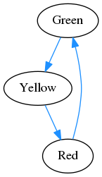

# Finite State machine for Laravel 5

This state machine was adapted from multiple existing state machines by Hyn and Sebdesign's Laravel wrapper for the Winzou State machine.

It is following Hyn's approach to use classes for configuration of States and Transitions because it gives a lot of flexibility letting your Transitions validate the state and it's results.

For a trivial example, see [./examples](./examples)

## Installation

To install via Composer, run the following command:

    composer require macghriogair/laravel-fsm

### For Laravel 5.4 and 5.3: add Service Provider

*Note: Since Laravel 5.5 the ServiceProviders are being registered automatically.*

If you are using an older version or have opted out of auto-discovery, add the following in config/app.php.

    'providers' => [
        Macgriog\StateMachine\ServiceProvider::class,
    ],

## Graphical debugging

It has a command for printing the definition in [Dot](https://www.graphviz.org/doc/info/lang.html) format, e.g.

    artisan macgriog:fsm-debug "Examples\Semaforo\TrafficLightMachine" | dot -Tpng -o semaforo.png

## References

- https://en.wikipedia.org/wiki/Finite-state_machine
- https://github.com/hyn/state-machine
- https://github.com/sebdesign/laravel-state-machine
- https://github.com/winzou/state-machine
